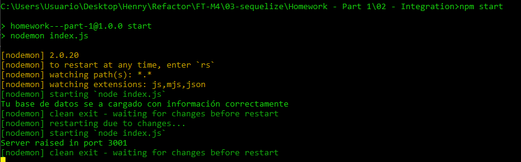

# HW 02: Sequelize | Integration

## **🕒 Duración estimada**

x minutos

---

<br />

## **📌 INTRO**

En esta homework pondremos en práctica todo lo que hemos aprendido hasta ahora sobre Sequelize. Aplicaremos nuestros conocimientos para conectar nuestro código con una nueva base de datos para nuestro proyecto de Rick & Morty.

---

<br />

## **✅ Pasos básicos para realizar la homework**

Para poder realizar esta homework, lo primero que deberás hacer es crear la base de datos que utilizaremos para nuestro proeycto de Rick & Morty. Para esto abre la terminal **`SQL Shell (psql)`** e ingresa con tu información. Utilizando el comando que ya conoces crea la base de datos que debe tener como nombre: **`rickandmorty`**. Hazlo con el siguiente comando:

Puedes verificar que se haya creado correctamente con el comando:

```SQL
   \l
```

Una vez que se haya creado correctamente deberás dirigite al archivo [**.env**](./.env) y escribir la contraseña que utilizas para ingresar a tu cuenta de PostgreSQL.

---

<br />

<h1 align="center">📋 INSTRUCCIONES</h1>

</br >

## **👩‍💻 EJERCICIO 1**

El primer paso es conectar nuestro código a la base de datos **rickandmorty**. Para esto, dirígete al archivo [**database/DB_connection**](./database/DB_connection.js), y completa el valor que necesita la instancia de Sequelize. ¡Te dejamos un template en el archivo!

---

</br >

## **👩‍💻 EJERCICIO 2**

Llegó el momento de crear nuestros modelos. Dirígete a la carpeta [**models**](./models/) y crea las propiedades para cada uno de los modelos: _Character_ y _User_. Aquí te dejamos las propiedades y el tipo de dato.

### **Character**

<details>
   <summary>id</summary>
   <ul>
      <li>Integer</li>
      <li>Not Null</li>
      <li>Primary Key</li>
   </ul>
</details>
<details>
   <summary>name</summary>
   <ul>
      <li>String</li>
      <li>Not Null</li>
   </ul>
</details>
<details>
   <summary>status</summary>
   <ul>
      <li>Enum (Alive - Dead - unknown)</li>
      <li>Not Null</li>
   </ul>
</details>
<details>
   <summary>species</summary>
   <ul>
      <li>String</li>
      <li>Not Null</li>
   </ul>
</details>
<details>
   <summary>gender</summary>
   <ul>
      <li>Enum (Female - Male - Genderless - unknown)</li>
      <li>Not Null</li>
   </ul>
</details>
<details>
   <summary>origin</summary>
   <ul>
      <li>String</li>
      <li>Not Null</li>
   </ul>
</details>
<details>
   <summary>image</summary>
   <ul>
      <li>String</li>
      <li>Not Null</li>
   </ul>
</details>
<details>
   <summary>isFav</summary>
   <ul>
      <li>Boolean</li>
      <li>Not Null</li>
   </ul>
</details>

</br>

### **User**

<details>
   <summary>id</summary>
   <ul>
      <li>Number</li>
      <li>Not Null</li>
      <li>Primary Key</li>
   </ul>
</details>
<details>
   <summary>username</summary>
   <ul>
      <li>String</li>
      <li>Not Null</li>
   </ul>
</details>
<details>
   <summary>password</summary>
   <ul>
      <li>String</li>
      <li>Not Null</li>
   </ul>
</details>

---

</br >

## **👩‍💻 EJERCICIO 3**

Una vez creados los modelos regresa al archivo [**database/DB_connection**](./database/DB_connection.js). En este ejercicio nos encargaremos de que, cuando levantemos el proyecto estos modelos se guarden en la base de datos. Para esto:

Ejecuta la función de cada modelo (ya están importadas al comienzo del archivo), pasándole como argumento la instancia de Sequelize ya creada. 👀 Revisa 👀 que hay comentado en el archivo un espacio para que realices este ejercicio.

---

</br >

## **😼 BREAK 😼**

En este momento ya deberíamos de poder levantar el proyecto y que todo esté funcionando correctamente. Para esto ejecuta el comando:

```bash
   npm start
```

<div align="center" >
   
</div>

---

<br />

## **👩‍💻 EJERCICIO 4**

¡Ahora si! Llegó el momento de guardar los personajes en nuestra base de datos. Para esto dirígete al archivo [**routes/apiToDB.js**](./routes/apiToDB.js). Aquí tendrás que crear **getAPIdata** una función que haga un request a la API de **`rick and morty`** y obtenga a todos los personajes.

Ten en cuenta que no obtendrás a todos los personajes con un sólo request, ya que la API los envía por página. Para este ejercicio sólo deberás obtener los primeros 100 personajes. Es decir que, el objetivo de esta función es retornar un arreglo con longitud igual a 100, donde en cada posición hay un personaje.

> [**NOTA**]: no te olvides de manejar el error.

Si te das cuenta, cada uno de los personajes trae mucha información que no utilizaremos, por lo que debes guardar, para cada personaje, únicamente las propiedades:

-  Id
-  Name
-  Species
-  Status
-  Origin
-  Gender
-  Image

> [**PISTA**]: ¡hay muchas formas de resolver esto! Te desafíamos a que utilices recursión, pero puedes hacerlo como más prefieras.

---

</br >

## **👩‍💻 EJERCICIO 5**

Una vez que tu función cumpla con su objetivo (retornar un arreglo de 100 personajes) tendremos que guardarlos en la base de datos. Para esto:

En el mismo archivo de antes encontrarás una función llamada **saveAPIdata**. Está funcion debe ejecutar a la función **getAPIdata**, y, a partir de su resultado, guardar todos los personajes en tu base de datos.

Recuerda que:

-  Cuando guardes a los personajes debes agregar una propiedad en cada uno de ellos llamada **`isFav`**, que será por default **false**.
-  Dentro del archivo ya está importado la tabla **characters** que tienes que utilizar.
-  Puedes guardar los personajes con la query **`findOrCreate`**.

> [**NOTA**]: no te olvides de manejar el error.

¡Una vez ya esté construida esta función, dirígete al archivo [**index.js**](./index.js) y ejecútala una vez la base de datos ya esté sincronizada!

---

<br />

## **👩‍💻 EJERCICIO 6**

Para validar que todo salió correctamente vamos a crear nuestra primera ruta GET, y obtener a todos nuestros personajes. Para esto dirígete al archivo [**getAllChars.js**](./routers/controllers/getAllChars.js). Aquí deberás crear una función que obtiene y retorna a todos los personajes de la base de datos. Utiliza el query **`findAll`**.

> [**NOTA**]: ya está importada la tabla que debes utilizar. No te olvides de manejar el error.

Una vez que hayas construido esta función puede compobar en tu iterador de APIs favorita (thunder, postman, insomnia, etc...) que esta ruta funcione correctamente. El endponit al que tienes que apuntar el request es:

```javascript
'http://localhost:3001/rickandmorty/allCharacters';
```

---

<br />

## **🔎 Recursos adicionales**

-  Documentación [**API Rick and Morty**](https://rickandmortyapi.com/documentation/#get-all-characters)

-  Documentación [**Sequelize**](https://sequelize.org/docs/v6/)

<div align="center">
   
</div>
